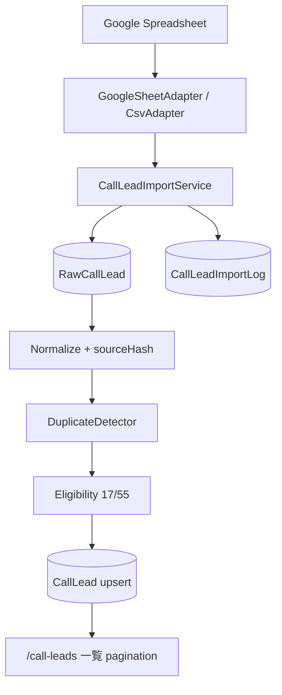

# Phase 6 — CallLead DB化・大量データ取込

**目的:** 架電リスト（約2万件・増加見込み）を Google スプレッドシートから CRM の PostgreSQL に取り込み、CRM 上では **必ず DB の CallLead のみ** を参照する。

**前提:** Phase 2.5（CallLead 基盤）完了、Phase 5（Job Operations / Google Sheets 基盤）完了

**状態:** 🚧 **Step 1〜5 実装完了（未コミット）** → Step 6 bulk 取込・デプロイ・Step 7 cron が次

---

## 目的

現在、架電リストは Google スプレッドシートで管理している（約2万件）。

今後はスプレッドシートを直接参照せず、以下の方式に変更する。

```
Google スプレッドシート
  ↓
ImportService
  ↓
RawCallLead
  ↓
Normalize / 判定
  ↓
CallLead（PostgreSQL）
  ↓
CRM 画面
```

---

## 重要方針

| 項目 | 方針 |
|------|------|
| スプレッドシート | **取込元のみ**。一覧・検索・架電・KPI 集計では直接参照しない |
| 正式データ | PostgreSQL 上の `CallLead` テーブル |
| 既存 CRM | Candidate / Activity / Communications / Job を壊さない |
| 既存 CallLead | **再利用・拡張**。二重実装しない |
| 画面 | 2万件を一度に表示しない。server-side pagination 必須 |
| 同期 | 現時点は**手動同期**。将来 cron 化できる構造にする |

---

## 対象データ

- 約 **2万件** の架電リスト
- 今後さらに増加する前提

---

## 必要モデル

### 既存 → 再利用

| モデル | 状態 | 備考 |
|--------|------|------|
| `CallLead` | ✅ 存在 | 列追加が必要（下記） |
| `CallLeadStatus` | ✅ 一致 | BLANK / HEARING / NO_ANSWER / DUPLICATE / OUT_OF_SCOPE / CONVERTED |
| `ImportSourceType` | ✅ 存在 | `GOOGLE_SHEET` 済み |
| `ImportLog` | ⚠️ 汎用 | CallLead 専用ログへ拡張 or 置換検討 |

### 新規追加

#### RawCallLead

スプレッドシートの元データを加工せず保存。

| 項目 | 型 | 備考 |
|------|-----|------|
| id | UUID | |
| tenantId | UUID | |
| sourceType | ImportSourceType | |
| sourceName | String | 取込元名 |
| sheetName | String | タブ名 |
| rowNumber | Int | 1始まり |
| rawData | Json | 行データ |
| sourceHash | String | 変更検知用 |
| importedAt | DateTime | |
| createdAt | DateTime | |

#### CallLeadImportLog

取込履歴（Job の `JobImportLog` と同パターン）。

| 項目 | 型 |
|------|-----|
| id | UUID |
| tenantId | UUID |
| sourceType | ImportSourceType |
| sourceName | String? |
| sheetName | String? |
| importedCount | Int |
| createdCount | Int |
| updatedCount | Int |
| duplicateCount | Int |
| outOfScopeCount | Int |
| skippedCount | Int |
| failedCount | Int |
| importedAt | DateTime |
| status | ImportLogStatus |
| errorMessage | Text? |

---

## CallLead 拡張項目（既存モデルへの追加）

| 項目 | 用途 |
|------|------|
| sourceSheet | 取込元タブ名 |
| sourceRowNumber | 取込元行番号 |
| sourceHash | 重複防止・変更検知・差分取込 |

> `sourceId` は既存。スプレッドシート行 ID 等との兼ね合いを実装時に整理する。

---

## ステータス

既存 `CallLeadStatus` をそのまま使用:

- `BLANK`
- `HEARING`
- `NO_ANSWER`
- `DUPLICATE`
- `OUT_OF_SCOPE`
- `CONVERTED`

---

## 自動判定

### 対象外（OUT_OF_SCOPE）

以下は自動判定（**既存 `lib/call-leads/eligibility.ts` と一致**）:

- **17歳以下**
- **55歳以上**

### 重複（DUPLICATE）

優先順位（**既存 `duplicate-detector.ts` と一致**）:

1. phone
2. email
3. name + age

対象:

- 既存 CallLead
- 既存 Candidate

重複時: `status = DUPLICATE`

---

## Upsert 方針

同じデータを二重登録しない。

既存判定優先順位:

1. `sourceName + sourceSheet + sourceRowNumber`
2. `sourceHash`
3. phone
4. email
5. name + age

- 既存データがあれば **更新**
- なければ **新規作成**

> **現状ギャップ:** `ImportService` は常に `create` のみ。Upsert 化が Phase 6 の核心。

---

## sourceHash

主要項目からハッシュ生成。

**用途:** 重複防止 / 変更検知 / 差分取込

**対象項目例:**

- name
- email
- phone
- age
- applicationArea
- appliedAt

---

## 取込処理フロー

`ImportService` を使用（画面側に Google Sheets 専用ロジックを書かない）。

1. Google Sheets または CSV からデータ取得（Adapter）
2. `RawCallLead` へ保存（chunk）
3. Normalize 処理
4. 重複判定
5. 対象外判定
6. `CallLead` へ upsert（chunk）
7. `CallLeadImportLog` 作成

---

## 大量データ対応（2万件以上）

| 対策 | 内容 |
|------|------|
| chunk 処理 | 500〜1000 件単位で Raw 保存・Normalize・Upsert |
| index | 下記推奨 index を追加 |
| 一覧 | server-side pagination 必須（50 / 100 件） |
| 検索 | DB 側で実行。全件をフロントへ渡さない |
| 同期 | 1 リクエストで全件処理しない（Job sync と同様タブ/chunk 分割） |

### 推奨 index

**CallLead（追加）**

- `[tenantId, phone]`
- `[tenantId, sourceHash]`
- `[tenantId, sourceName, sourceSheet, sourceRowNumber]`（unique 検討）
- `[tenantId, assignedUserId]`
- `[tenantId, createdAt]`

**RawCallLead**

- `[tenantId, sourceHash]`
- `[tenantId, sourceName, sheetName, rowNumber]`

---

## UI

### 一覧 `/call-leads`

| 要件 | 現状 | Phase 6 |
|------|------|---------|
| server-side pagination | ❌ 全件 `findMany` | ✅ 必須 |
| search query | ✅ DB 側 | 維持 |
| status / assigned / source / age / area filter | ✅ あり | 維持・拡張 |
| 1ページ件数 | — | 50 / 100 |
| グレーアウト | ✅ DUPLICATE / OUT_OF_SCOPE | ✅ + CONVERTED |

### 同期 `/call-leads/import` または `/call-leads/sync`

| 機能 | 現状 | Phase 6 |
|------|------|---------|
| CSV 取込 | ✅ | 維持 |
| Google Sheets 手動同期 | ❌ | ✅ |
| 取込元選択 | ❌ | ✅ |
| 取込結果表示 | △ ImportLog | ✅ CallLeadImportLog |
| ImportLog 一覧 | △ 汎用 ImportLog | ✅ 専用ログ |
| エラー内容確認 | △ | ✅ |

### Google Sheets 同期

- 現時点: **手動同期**
- 将来: cron 化可能な構造（`/api/cron/call-lead-sync` + GitHub Actions）

---

## 現状実装との差分（ギャップ分析）

| 領域 | 現状 | Phase 6 で必要なこと |
|------|------|----------------------|
| `RawCallLead` | なし | 新規モデル + migration |
| `CallLeadImportLog` | なし（汎用 `ImportLog`） | 新規 or 拡張 |
| `CallLead` 列 | sourceSheet / sourceRowNumber / sourceHash なし | 列追加 |
| Google Sheets Adapter | Job のみ（`lib/jobs/sheets/`） | CallLead 用 Adapter 新設 |
| `ImportService` | CSV / Manual、create のみ | Upsert + Raw  staging + chunk |
| 一覧 | 全件取得 | pagination |
| CRM 参照 | 既に DB のみ | 方針維持（Sheets 直参照なし） |
| 重複・対象外判定 | 実装済み | Upsert 判定に統合 |
| Cron | なし | 将来用 API のみ設計 |

---

## 実装計画（コード変更前の提示）

### 1. 現在の CallLead 関連実装の確認結果

**DB / Schema**

- `CallLead`, `CallLeadNote`, `CallLeadActivity`, `CallAttempt`, `ImportLog` — 存在
- `CallLeadStatus`, `ImportSourceType.GOOGLE_SHEET` — 存在
- `RawCallLead`, `CallLeadImportLog` — **未存在**

**取込**

- `lib/import/import-service.ts` — Adapter パターン、行単位 create
- `lib/import/adapters/csv-adapter.ts`, `manual-adapter.ts` — 存在
- Google Sheets Adapter（CallLead）— **未存在**（Job 側 `lib/jobs/sheets/` を参考に新設）

**ドメイン**

- `lib/call-leads/duplicate-detector.ts` — phone → email → name+age（CallLead + Candidate）
- `lib/call-leads/eligibility.ts` — 17以下 / 55以上 → OUT_OF_SCOPE
- `lib/validators/call-lead-import.ts` — 行バリデーション

**UI**

- `/call-leads` — フィルタ・グレーアウトあり、**pagination なし**
- `/call-leads/import` — CSV のみ
- `/call-leads/[id]` — 詳細・架電・Candidate 化

**参考実装（Job Operations）**

- `lib/jobs/import/job-import-service.ts` — RawJob → Normalize → Upsert
- `lib/jobs/sheets/google-sheets-client.ts` — Sheets API + グレー行検出
- `.github/workflows/sync-jobs.yml` — タブ分割 cron

---

### 2. 変更対象ファイル（予定）

| 区分 | ファイル |
|------|----------|
| Schema | `prisma/schema.prisma` |
| Migration | `prisma/migrations/2026xxxx_call_lead_bulk_import/` |
| Raw 取込 | `lib/call-leads/import/`（新規ディレクトリ） |
| Adapter | `lib/call-leads/import/adapters/google-sheet-adapter.ts`, `csv-adapter.ts`（移行 or ラップ） |
| Service | `lib/import/import-service.ts` → 拡張 or `lib/call-leads/import/call-lead-import-service.ts` |
| Normalize | `lib/call-leads/import/normalize.ts`, `source-hash.ts` |
| Upsert | `lib/call-leads/import/upsert.ts` |
| Queries | `lib/call-leads/queries.ts`, `lib/actions/call-leads.ts` |
| Actions | `lib/actions/call-lead-import.ts` |
| UI 一覧 | `app/(dashboard)/call-leads/page.tsx`, `components/call-leads/call-lead-table.tsx` |
| UI 同期 | `app/(dashboard)/call-leads/import/page.tsx` or `/call-leads/sync` |
| Cron（将来） | `app/api/cron/call-lead-sync/route.ts`, `.github/workflows/sync-call-leads.yml` |
| Docs | `docs/handoff/README.md`, `docs/database-design.md` |

---

### 3. Prisma 変更内容（予定）

```text
+ model RawCallLead { ... }
+ model CallLeadImportLog { ... }

~ model CallLead {
+   sourceSheet       String?
+   sourceRowNumber   Int?
+   sourceHash        String?
+   @@index([tenantId, phone])
+   @@index([tenantId, sourceHash])
+   @@index([tenantId, sourceName, sourceSheet, sourceRowNumber])
+   @@index([tenantId, assignedUserId])
+   @@index([tenantId, createdAt])
  }

~ Tenant relations (+ rawCallLeads, callLeadImportLogs)
```

---

### 4. Migration 内容（予定）

1. `call_leads` に `source_sheet`, `source_row_number`, `source_hash` 列追加
2. `raw_call_leads` テーブル新規
3. `call_lead_import_logs` テーブル新規
4. 上記 index 追加
5. （任意）既存 `import_logs` は CallLead 用として残すか、新ログへ移行するか Phase 6 Step 1 で決定

---

### 5. データフロー



**Upsert 判定順:**

```
sourceName+sheet+row → sourceHash → phone → email → name+age → create
```

**chunk 単位（500〜1000 行）:**

```
fetch rows → insert RawCallLead batch → normalize batch → upsert CallLead batch → update log
```

---

### 6. 大量データ対応方針

| レイヤ | 方針 |
|--------|------|
| Sheets 取得 | タブ単位。行は chunk で Raw 保存 |
| DB 書込 | `createMany` / バルク upsert（`INSERT ... ON CONFLICT` または Prisma トランザクション chunk） |
| 重複検索 | phone / email に index。バッチ内は in-memory tracker（既存パターン） |
| API / Server Action | 1 回の同期で全 2 万件を 1 トランザクションにしない |
| 一覧 | `skip/take` + `count` クエリ。searchParams で page / pageSize |
| Vercel  timeout | Job sync 同様、chunk + 将来 cron はタブ/chunk 分割 |
| テナント上限 | 既存 `enforce-limits` を chunk ごとに適用 |

---

### 7. 実装手順（推奨ステップ）

#### Step 1 — DB 基盤
- [x] Prisma: `RawCallLead`, `CallLeadImportLog`, `CallLead` 列追加
- [x] Migration 作成・適用（`20260629100000_call_lead_bulk_import`）
- [x] `source-hash.ts` 実装

#### Step 2 — ImportService 拡張
- [x] `CallLeadImportService`（Raw 保存 → Normalize → Upsert → Log）
- [x] chunk 処理（500 件）
- [x] Upsert 判定ロジック（5 段階優先順位）
- [x] 既存 CSV / Manual を新サービス経由に統合

#### Step 3 — Google Sheets Adapter
- [x] スプレッドシート設定（`CALL_LEAD_SPREADSHEET_ID` 等）
- [x] `GoogleSheetAdapter`（Job 側クライアント再利用）
- [x] 列マッピング（`CSV_HEADER_MAP` 再利用）

#### Step 4 — 一覧 pagination
- [x] `getCallLeadsForUser` に `skip/take/count` 追加
- [x] UI: ページネーション（50 / 100 件）
- [x] CONVERTED グレーアウト

#### Step 5 — 同期 UI
- [x] `/call-leads/import` 拡張
- [x] 手動同期ボタン（Google Sheets）
- [x] `CallLeadImportLog` 一覧・エラー表示

#### Step 6 — 初回 bulk 取込
- [ ] `.env.local` / Vercel に `CALL_LEAD_SPREADSHEET_ID` 設定
- [x] CLI: `scripts/sync-call-leads.ts`, `scripts/inspect-call-lead-sheet.ts`, `scripts/verify-call-lead-import.mjs`
- [ ] preflight: `npm run call-leads:inspect`
- [ ] 本番取込: `npm run call-leads:sync` または UI
- [ ] 取込後 KPI・一覧性能確認: `npm run verify:call-lead-import`

#### Step 7 — Cron 準備（任意・将来）
- [ ] `/api/cron/call-lead-sync`
- [ ] GitHub Actions workflow（chunk / タブ分割）

---

## 環境変数（予定）

| 変数 | 説明 |
|------|------|
| `CALL_LEAD_SPREADSHEET_ID` | 架電リスト用スプレッドシート ID |
| `GOOGLE_SERVICE_ACCOUNT_JSON` | Job と共用可 |
| `CALL_LEAD_SYNC_TENANT_ID` | （任意）Cron 対象 tenant |
| `CRON_SECRET` | Cron API 認証（Job と共用） |

---

## 注意事項

- 2 万件を一度に画面表示しない
- 同期処理中に既存 CRM 機能を壊さない
- 既存 CallLead（手動 / CSV 取込分）は Upsert 時に上書きルールを明確化
- `ImportLog`（汎用）と `CallLeadImportLog`（専用）の役割分担を Step 1 で決定

---

## 関連ドキュメント

- [phase-2.5.md](./phase-2.5.md) — CallLead 初版
- [phase-5.md](./phase-5.md) — Job Operations（Sheets 基盤の参考）
- [README.md](./README.md) — ロードマップ索引
